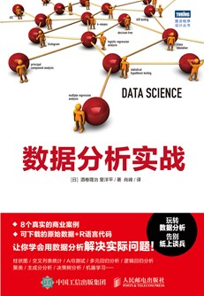

# 《数据分析实战》for Python

## 说明

该项目代码是《数据分析实战》Python实现方式，这本书是为数比较少讲APP方面数据科学的书籍，统计学习、机器学习具有涉及，强烈建议阅读。由于该书是用R语言写的，本人早期的时候也用R这几年转Python，书籍代码不难在R上也可以运行，但是Python的可读性更强，基本上都会有替换的包。对于初学的人还是建议学Python入门，所以该项目为该书的Python读者提供代码实现。

## 进度

|  章节  | 进度 |      |
| :----: | :--: | ---- |
| 第3章  | 100% |      |
| 第4章  | 100% |      |
| 第5章  | 100% |      |
| 第6章  | 90%  |      |
| 第7章  | 90%  |      |
| 第7章  | 90%  |      |
| 第9章  | 90%  |      |
| 第10章 | 90%  |      |

